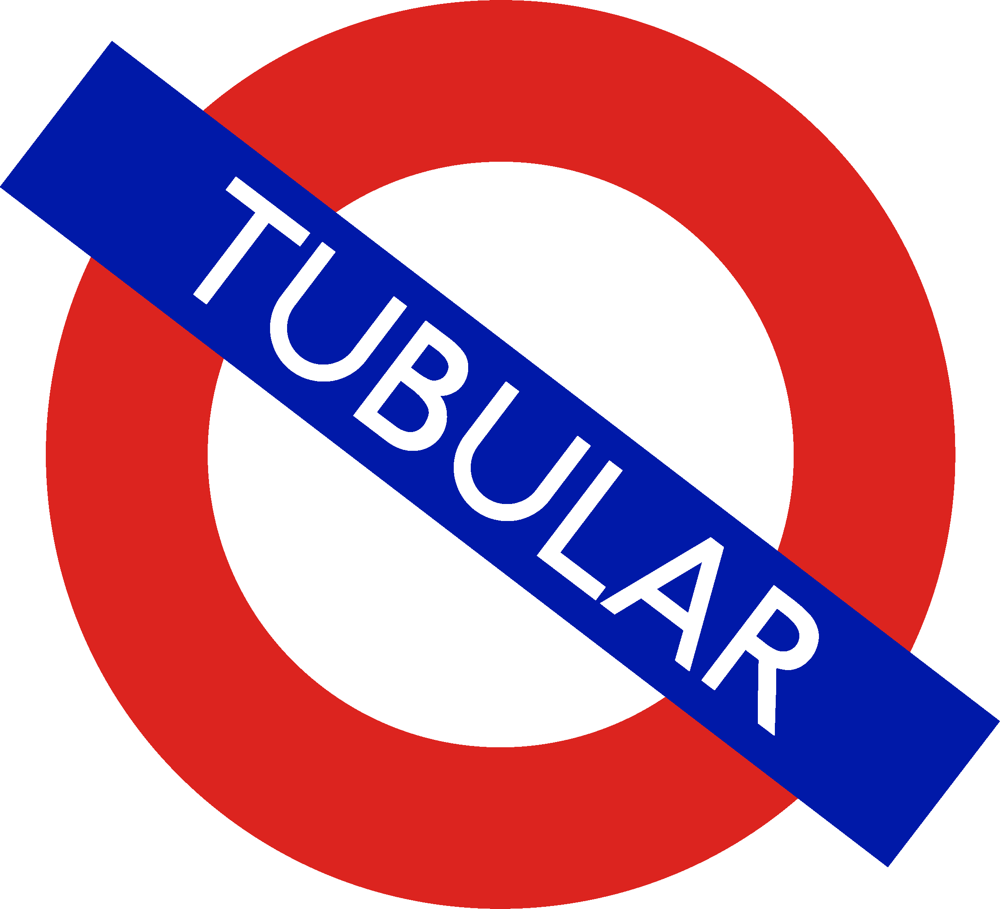

# Tubular - _your Oyster history, on an SVG TfL Map_

## Eventually/If ever/For someone else to do
- [ ] Inital zoom-in is on user's location
- [ ] User profiles
	- [ ] Login
	- [ ] Data saved in database, not LS
- [ ] Hover on line/stations for emphasis and information (number of visits, last visit)
- [ ] Bus route data
	- [ ] Button/Icon in the corner
	- [ ] Reveals list of bus routes in London, shaded in if used
		- Bus number, From–To, No. times used
- [ ] Map of Riverboat services
- [ ] Stats
	- [ ] % of stations visited
		- [ ] on a line
		- [ ] on the whole TfL service
		- [ ] in Zones?
	- [ ] % of a line travelled through
	- [ ] miles travelled in a year or overall
- [ ] Challenges/Achievments
	- [ ] Streak: visit a new station every month
		- 272 stations; 272/12 = 22 years to do them all
	- [ ] Travel through the whole of each line
		- Stations at either end have to be visited
		- 11 lines + overground + trams
	- [ ] Visit every station on a line
		- [ ] Progress bar is in the colour of the line (of course)
	- [ ] Use every line
	- [ ] Use every branch of the Northern line?
		- Or another fun one that is one of the idiosyncracies of TfL
	- [ ] Visit every zone
	- [ ] Use every overground line
	- [ ] Gotten the first/last train of the day of that line/on TfL
- [ ] Draw Zone boundaires on map
	- [ ] Toggle on/off by user
- Leaderboards?
	- Would require authentication of CSVs
		- Complicated:- See if their journeys were feasible. Times taken + whether the line/stations were open on that day/time + gap between entries
		- Easier:- User hsitory. Not too many visited too often. Account age and number of stations visited.
		- Easiest:- Honour system
	- Can be turned on/off by users
	- Rankings of users stats